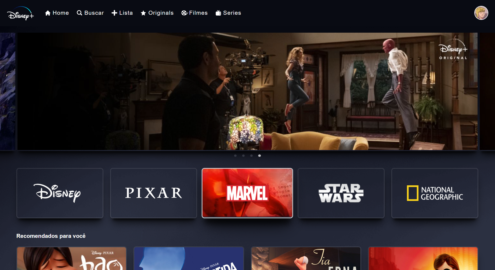

# Disney+ Clone
Este projeto é um clone do popular site de streaming Disney+, desenvolvido utilizando React, Redux, Styled Components, Firebase e autenticação/login com Google.
[Clique aqui para acessar]( https://www.exemplo.com](https://dinseyplusclone.web.app )

## Funcionalidades
Login com Conta Google
Os usuários podem fazer login no site utilizando sua conta do Google, proporcionando uma experiência de autenticação rápida e segura.

### Slider/Carrossel de Filmes
O site apresenta um slider/carrossel com alguns filmes em destaque, proporcionando uma experiência visual envolvente para os usuários.

### Principais IPs do Disney+
Exibe as principais IPs (Disney, Pixar, Marvel, Star Wars e National Geographic) em uma seção dedicada, destacando o diversificado catálogo do Disney+.

### Seções de Conteúdo
O conteúdo do site está organizado em quatro seções principais:

Recomendados: Filmes e séries recomendados com base nas preferências do usuário.
Novos: As últimas adições ao catálogo do Disney+.
Originais: Conteúdo exclusivo produzido pelo Disney+.
Em Alta: Filmes e séries populares no momento.
Detalhes do Filme
Ao clicar em um filme, os usuários são redirecionados para uma página de detalhes, onde informações adicionais sobre o filme são exibidas. Esses dados são obtidos a partir do banco de dados Firebase.

### Tecnologias Utilizadas
React: Biblioteca JavaScript para construção de interfaces de usuário.
Redux: Gerenciamento de estado para uma gestão eficiente dos dados da aplicação.
Styled Components: Biblioteca para estilização de componentes React com a utilização de estilos no nível do componente.
Firebase: Plataforma de desenvolvimento móvel e web que fornece uma variedade de serviços, incluindo autenticação e banco de dados em tempo real.

### Instruções de Execução
Certifique-se de ter o Node.js instalado em sua máquina. Clone o repositório e execute os seguintes comandos:

### Instalação das dependências
npm install

### Inicialização do aplicativo

npm start

O aplicativo estará disponível em http://localhost:3000.

Observação: Antes de executar o aplicativo, configure as credenciais do Firebase para habilitar a autenticação com o Google e o acesso ao banco de dados.

### ScreenShot - Tela Principal

